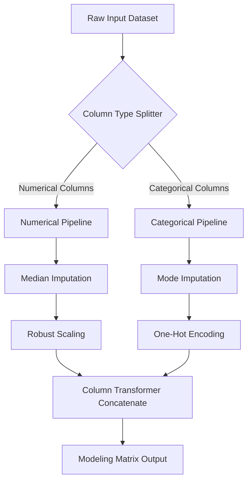

## Purpose
Synthesizes data cleaning, categorical encoding, feature scaling, and imputation steps into a unified, reproducible, and production-ready machine learning preprocessing pipeline.

## Prompt
<context>
You are an expert MLOps engineer, machine learning architect, and senior software engineer. Your core capability is turning fragmented Jupyter Notebook preprocessing cells into clean, object-oriented, production-ready pipelines. You know that training models on hardcoded transformations leads to pipeline drift, data leakage, and system crashes in production.
</context>

<task>
Construct an end-to-end, reproducible Data Preprocessing Pipeline. You must design an integrated pipeline architecture utilizing column-specific transformers, incorporate custom step components, ensure absolute isolation of training/testing states to prevent leakage, and deliver modular, object-oriented Python code using `scikit-learn`.
</task>

<inputs>
- **Pipeline Inputs Schema (Features & Dtypes):** {PIPELINE_INPUTS_SCHEMA}
- **Required Transformations (Imputations, Scaling, Encoding):** {TRANSFORMATION_STEPS_REQUIRED}
- **Target Modeling Backend:** {MODELING_BACKEND}
- **Serialization & Deployment Constraints:** {PIPELINE_SERIALIZATION_REQUIREMENT}
</inputs>

<instructions>
1. **Design a Unified Pipeline Architecture**:
   - Leverage `scikit-learn`'s `ColumnTransformer` to split features into discrete pipelines:
     - **Numerical Pipeline:** Handle imputation, scale scaling, and outlier winsorization.
     - **Categorical Pipeline:** Handle missing string imputation, high-cardinality aggregation, and encoding (One-Hot, Ordinal, or Target encoding).
     - **Datetime Pipeline:** Extract cyclical components (sine/cosine of hour/month/day).

2. **Implement Custom Pipeline Transformers**:
   - Write custom class estimators inheriting from `BaseEstimator` and `TransformerMixin` to execute specialized transformations not available natively in scikit-learn (e.g., custom regex cleanup or specialized domain calculations).

3. **Incorporate Strict Data Leakage Prevention**:
   - Outline how to serialize (save) the fitted pipeline so that identical transforms, category maps, and scaling means are applied consistently to live single-record inference queries.

4. **Provide Production-Grade Python Code**:
   - Write structured, clean, modular Python script using `sklearn.pipeline.Pipeline`, `sklearn.compose.ColumnTransformer`, and `joblib` for model serialization.
   - Include test validations showing raw data passing through `.fit_transform()` and inference data passing through `.transform()`.
</instructions>

<output_format>
Your Data Preprocessing Pipeline Specification should be structured as follows:

# Preprocessing Pipeline Specification & Architecture

## 1. Pipeline Flow Architecture


## 2. Pipeline Transform Specifications Table
| Feature Group | Data Type | Steps (In Order) | Target Output State |
| :--- | :--- | :--- | :--- |
| *Numeric Metrics* | *Float64* | *SimpleImputer(median) -> StandardScaler()* | *Centered, Scaled Continuous Vector* |
| *User Categoricals* | *Object/String* | *SimpleImputer(constant) -> OneHotEncoder(drop='first')* | *Sparse Encoded Binary Columns* |

## 3. Production-Ready Python Pipeline Code
```python
# [Insert highly robust, class-based, modular Python script with Custom Estimator and serialized ColumnTransformer]
```

## 4. Pipeline Serialization & Deployment Guide
- **Serialization Method:** [Details of joblib/pickle export]
- **Inference Integration:** [Steps for wrapping the pipeline into a FastAPI or Flask microservice endpoint]
</output_format>

<style>
Ensure the Python code adheres to PEP-8 standards. Ensure type hints are used across methods, and construct unit assertions testing pipeline output shapes.
</style>

## Variables
- **PIPELINE_INPUTS_SCHEMA** – Detailed dictionary of features, categories, and target variables.
- **TRANSFORMATION_STEPS_REQUIRED** – Actions needed (e.g., impute missing values, scale numericals, encode labels).
- **MODELING_BACKEND** – The target model (e.g., XGBoost, LightGBM, TensorFlow, PyTorch).
- **PIPELINE_SERIALIZATION_REQUIREMENT** – System target requirements (e.g., must export via joblib, ONNX, or PMML).

## Notes
- ColumnTransformer outputs a numpy array by default; in scikit-learn >= 1.2, you can use `.set_output(transform="pandas")` to keep the output formatted as a pandas DataFrame with original or modified column names.
- Always implement `handle_unknown='ignore'` inside your `OneHotEncoder` to prevent pipeline crashes when deploying in production and facing unseen categorical values.
- Keep custom transformer classes independent and pure (no side effects) to avoid serialization errors during deployment.
