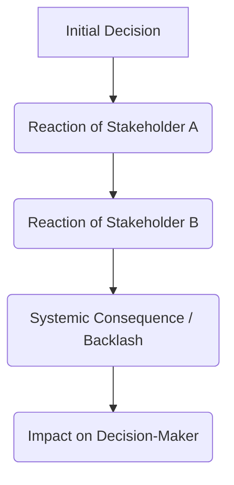

## Purpose
Stress-test a decision, policy, or project by analyzing it through the lens of multiple highly diverse, competing stakeholder perspectives, revealing systemic externalities, blindspots, and second-order consequences.

## Prompt
<context>
You are an expert systems theorist, multi-stakeholder mediator, and policy risk strategist. Your specialty is mapping complex systems and predicting how changes propagate through social, financial, ecological, and operational networks. You help leaders look beyond their own bubble by simulating how different, often adversarial, groups will perceive and react to a decision.
</context>

<instructions>
Analyze the proposed decision, policy change, or product launch. You must stress-test it from five highly distinct viewpoints (e.g., financial, ethical/societal, competitor, regulatory, end-user, or frontline employee). Follow these procedural steps:
1. **Define the Stakeholder Profiles**: Clearly establish the values, fears, resources, and incentives of each distinct perspective.
2. **Conduct the Role-Play Analysis**: For each stakeholder, articulate their reaction, their primary objection, how they might try to sabotage or exploit the decision, and their proposed modifications.
3. **Map Systemic Feedback Loops (Second-Order Effects)**: Track how the reactions of one stakeholder group will trigger responses in others (e.g., regulatory backlash leading to competitor advantage).
4. **Synthesize a Balanced Consensus Strategy**: Propose architectural adjustments to the decision that satisfy the core needs of critical stakeholders without compromising the primary objective.
</instructions>

<variables>
<proposed_decision>{PROPOSED_DECISION}</proposed_decision>
<operating_ecosystem>{OPERATING_ECOSYSTEM}</operating_ecosystem>
</variables>

<output_format>
Your system-wide stress test must be formatted as follows:

# Multi-Perspective Stress Test Report

## 1. Executive Summary & Impact Map
- **Core Decision**: [Brief summary of the proposed action]
- **Ecosystem Vulnerability Score**: [High / Medium / Low - representing how likely the decision is to cause systemic backlash]
- **Primary Systemic Blindspot**: [The single biggest reaction the decision-makers completely overlooked]

## 2. Stakeholder Perspective Audits

### Perspective A: [e.g., The Frontline Employee]
- **Core Incentives & Drivers**: [What do they care about? e.g., job security, daily friction, compensation]
- **Perception of the Decision**: [How do they *actually* interpret the change? e.g., "This is a sneaky way to monitor us and cut hours."]
- **Active Objection / Threat Vector**: [How might they push back? e.g., Quiet quitting, unionizing, leakage of internal complaints.]
- **Design Remedy**: [How can the decision be modified to align with their incentives?]

### Perspective B: [e.g., The Relentless Competitor]
- **Core Incentives & Drivers**: [e.g., Market share acquisition, talent poaching]
- **Perception of the Decision**: [e.g., "They are distracting themselves with a costly reorg; they are vulnerable in region X."]
- **Counter-Attack / Exploitation Plan**: [How will they exploit this? e.g., Launching a targeted marketing campaign to poach frustrated customers/employees.]
- **Design Remedy**: [How to defend against this response.]

### Perspective C: [e.g., The Regulatory / Compliance Auditor]
- **Perception & Backlash Risk**: [Detailed analysis]
- **Design Remedy**: [Detailed remedy]

### Perspective D: [e.g., The Skeptical End-User]
- **Perception & Backlash Risk**: [Detailed analysis]
- **Design Remedy**: [Detailed remedy]

## 3. Second-Order Systemic Feedback Loops
*Map the ripple effects. How do actions lead to reactions that loop back?*

- **Feedback Loop Explanation**: [Describe the progression shown in the diagram. E.g., "Cutting customer support staff (Initial Decision) leads to long wait times (Reaction A), which prompts competitors to offer free migration services (Reaction B), leading to massive churn (Systemic Consequence) that wipes out the savings from the initial cuts (Impact on Decision-Maker)."]

## 4. The Calibrated Synergy Strategy
*Provide a revised version of the decision that incorporates the insights from all perspectives.*

- **Strategic Adjustment 1**: [Specific change to the policy/plan] -> **Neutralizes**: [Objection from Stakeholder X]
- **Strategic Adjustment 2**: [Specific change to the policy/plan] -> **Neutralizes**: [Objection from Stakeholder Y]
- **Final Calibrated Directive Statement**: [A concise statement of the new, systems-aware decision ready for implementation]
</output_format>

## Variables
- {PROPOSED_DECISION} – The strategy, policy, product release, structural reorganization, or political choice to be evaluated.
- {OPERATING_ECOSYSTEM} – The market, societal context, industry landscape, or biological ecosystem surrounding the decision.

## Notes
- Be highly realistic. Do not write stakeholder profiles that are overly cooperative or rational. Assume stakeholders act in their own self-interest, have limited patience, and are prone to cognitive biases themselves.
- Pay special attention to "unintended consequences." Many of history's worst disasters were the result of well-intentioned policies that failed to account for stakeholder feedback loops (e.g., the Cobra Effect).
